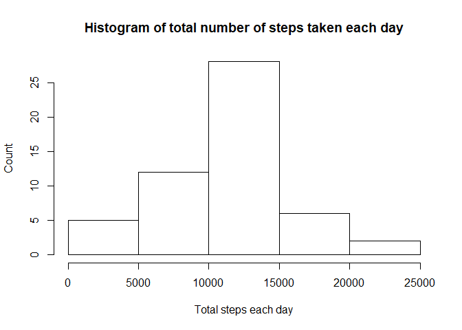
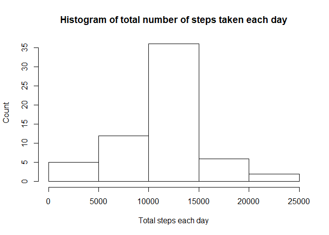
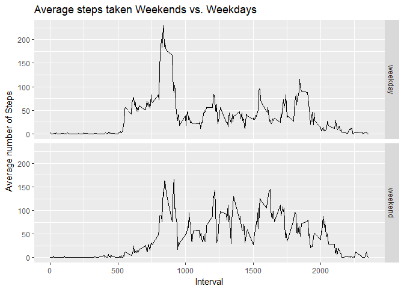

### Reading and processing data

```r
# Reading activity data
activityData <- read.csv("activity.csv")
```


## What is mean total number of steps taken per day?

### Calculating the total number of steps per day, plotting histogram, mean and median

```r
# Sum up the total steps by date
aggActivity <- aggregate(steps ~ date, data = activityData,sum)

# Show histogram of steps per day
hist(aggActivity$steps, main="Histogram of total number of steps taken each day", xlab="Total steps each day", ylab="Count")
```

<!-- -->

```r
# Calculate the mean and median of the total steps per day
stepsMean <- mean(aggActivity$steps)
stepsMedian <- median(aggActivity$steps)
```
#### The mean of the total number of steps per day is 10766.19 and median is 10765.


## What is the average daily activity pattern?

### Calculating average and plotting time series plot


```r
# Average the number of steps by interval
avgActivity <- aggregate(steps ~ interval, data = activityData,mean)

# Plot the average activity
plot(avgActivity$interval,avgActivity$steps, type = "l", main="Average steps taken during 5 minute interval", xlab="Interval",ylab = "Average steps taken")
```

<!-- -->

```r
maxStepInterval <- avgActivity$interval[which.max(avgActivity$steps)]
```
### The interval with the highest average number of steps is 835.


## Inputing missing values

```r
# Finding number of NA step values in activity data
missingValues <- sum(is.na(activityData$steps))
```
### The number of measurements having missing values is 2304

### Finding NA values and substituting with interval mean of that 5 minute interval

```r
# Create new dataset
filledActivityData <- activityData

# filling missing step values in new dataset with average for that 5 minute interval
for (i in 1:nrow(filledActivityData)) {
  if(is.na(filledActivityData$steps[i])) {
    ndx <- which(filledActivityData$interval[i] == avgActivity$interval)
    filledActivityData$steps[i] <- avgActivity$steps[ndx]
  }
}
```

### From new filled data, plot new histogram and find mean and median

```r
# Sum up the total steps by date
filledAggActivity <- aggregate(steps ~ date, data = filledActivityData,sum)

# Show histogram of steps per day
hist(filledAggActivity$steps, main="Histogram of total number of steps taken each day", xlab="Total steps each day", ylab="Count")  
```

<!-- -->

```r
# Calculate the new mean and median of the total steps per day
filledStepsMean <- mean(filledAggActivity$steps)
filledStepsMedian <- median(filledAggActivity$steps)
```

#### The mean of the total number of steps per day is 10766.19 and median is 10766.19.

### After filling in missing values, the mean has stayed the same, but the median has moved and become equal to the mean.


## Are there differences in activity patterns between weekdays and weekends?

```r
# Add weekday variables based on date
filledActivityData$day <- weekdays(as.Date(filledActivityData$date))

# Add weekdaytype variable and mark all as weekday.
filledActivityData$daytype <- "weekday"

# Change weekdaytype variable to weekend for Saturday and Sunday
filledActivityData$daytype[filledActivityData$day %in% c("Saturday", "Sunday")] <- "weekend"
```

### From new filled data, plot new histogram and find mean and median

```r
suppressWarnings(library(ggplot2))
# Group steps by weekdaytype and interval

dayAggActivity <- aggregate(steps ~ daytype + interval, data = filledActivityData,mean)

# Plot weekday vs weenend data
qplot(interval, steps, data=dayAggActivity,
      geom="line",
      xlab="Interval",
      ylab="Average number of Steps",
      main="Average steps taken Weekends vs. Weekdays",
      facets =daytype ~ .)
```

<!-- -->
